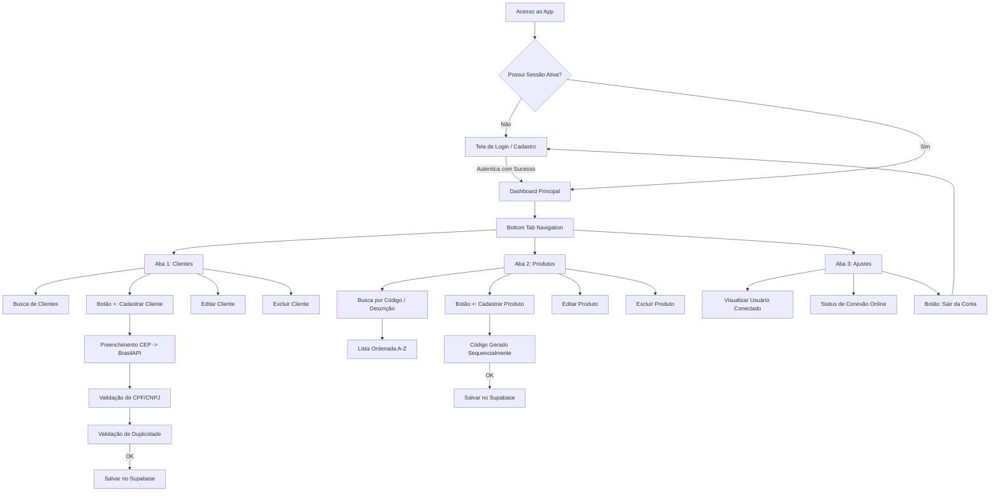
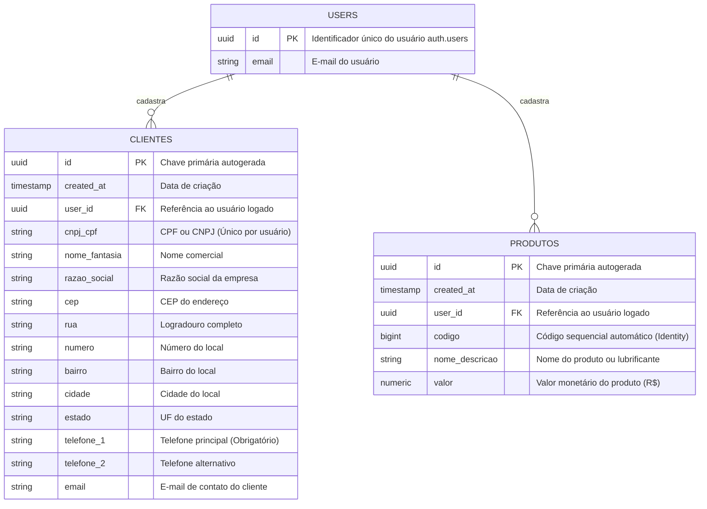

# 📖 Manual do Usuário e Arquitetura - Allub Lubrificantes

Este manual descreve a arquitetura de banco de dados, o fluxo de navegação do usuário e os procedimentos de configuração e execução do sistema **Allub Lubrificantes**.

---

## 📊 Diagramas de Arquitetura

### 1. Diagrama de Fluxo e Navegação (User Flow)
O diagrama abaixo representa a jornada do usuário móvel dentro do aplicativo, desde a autenticação até o gerenciamento de registros nas abas.



---

### 2. Diagrama Entidade-Relacionamento (Banco de Dados)
O modelo de banco de dados utiliza a segurança do Supabase baseada em Row Level Security (RLS), isolando os registros de clientes e produtos por meio do identificador de usuário (`user_id`).



---

## 🛠️ Guia de Inicialização e Execução

### Pré-requisitos
Certifique-se de possuir o [Node.js](https://nodejs.org/) instalado em seu computador.

### Passo 1: Instalação de Dependências
Abra o terminal na pasta raiz do projeto e execute:
```bash
npm install
```

### Passo 2: Configuração de Variáveis de Ambiente
Renomeie o arquivo `.env.example` para `.env` ou configure o arquivo `.env` existente com as suas chaves do Supabase:
```env
VITE_SUPABASE_URL=https://sua-url-do-supabase.supabase.co
VITE_SUPABASE_ANON_KEY=sua-chave-anon-key-aqui
```

### Passo 3: Executar Banco de Dados (Supabase)
1. Acesse o console do seu projeto no Supabase.
2. Navegue até a seção **SQL Editor** e clique em **New Query**.
3. Copie o conteúdo do arquivo `supabase_schema.sql` presente na raiz deste projeto, cole-o no editor e clique em **Run**.
4. Isso criará as tabelas `clientes` e `produtos` e habilitará as políticas de segurança RLS.

### Passo 4: Executar Localmente
Para rodar o app localmente em modo de desenvolvimento:
```bash
npm run dev
```
O terminal exibirá a URL local (geralmente `http://localhost:5173`) para acessar o aplicativo móvel diretamente no seu navegador.

### Passo 5: Executar Testes
Para rodar a suíte de testes unitários com o Vitest:
```bash
npm run test
```

### Passo 6: Compilar para Produção
Para gerar a versão otimizada pronta para deploy:
```bash
npm run build
```
Os arquivos finais de produção serão gerados na pasta `/dist` e podem ser hospedados gratuitamente na Vercel, Netlify ou Cloudflare Pages.
